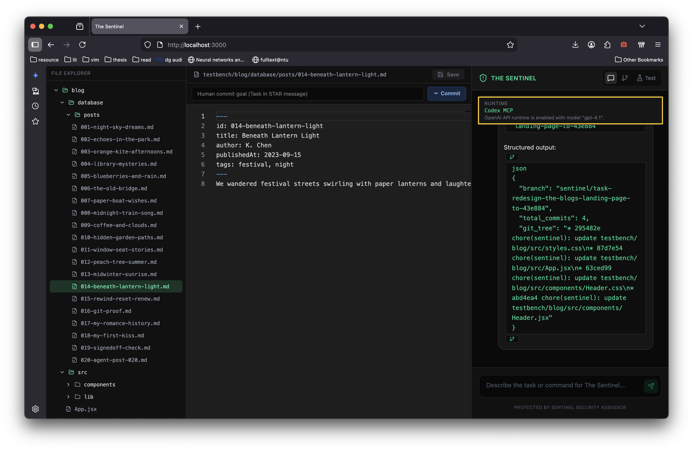

# The Sentinel

The Sentinel is a safe, human-governed AI coding agent that acts as a contributor rather than a dictator.

Project Demo Video: [YouTube](https://www.youtube.com/watch?v=hjGhiMHuoCQ)

## 1. Innovations

- **Agent-as-Contributor:** The AI does not blindly overwrite files; it works in isolated branches and proposes atomic commits that humans can review before merge.
- **Git-Integrated Governance:** The app includes a visual Git tree so humans can inspect diffs, revert commits, check out history safely, and explicitly approve/reject AI branches.
- **Policy-as-Code Safety Wrapper:** Sentinel guardrails intercept risky actions (data wipes, environment wipes, secret leaks) before execution and require human approval for destructive operations.

## 2. Prerequisites & Environment Variables

### Required software

- `Git` (2.30+)
- `Node.js` (18+ recommended)
- `npm` (9+ recommended)
- Codex/OpenAI API access (`OPENAI_API_KEY`)

### Optional software (only for standalone Python API demo)

- `Python` (3.10+)
- `uv` (latest)

### Dependencies

- Frontend + app server dependencies are managed by `npm` via [`package.json`](TheSentinel/package.json).
- Optional Python safeguard API dependencies are managed by [`requirements.txt`](TheSentinel/requirements.txt).

### Environment setup

Create a `.env.local` file in repository root:

```bash
cp .env.example .env.local
```

Set required values:

```env
OPENAI_API_KEY=your_api_key_here
# Optional model override:
OPENAI_MODEL=gpt-4.1
# Optional base URL override:
# OPENAI_BASE_URL=https://api.openai.com/v1
APP_URL=http://localhost:3000
```

Notes:
- If your platform/provider issues a `CODEX_API_KEY`, map it to `OPENAI_API_KEY` for this project runtime.
- Do not commit `.env.local`.

## 3. Setup & Installation (Platform Agnostic)

Run from repository root: `TheSentinel`


### Default setup (recommended)

**Before all setup, you need to go to `/TheSentinel/testbench/blog/` and change `.git.trick` to `.git`, and `.gitignore.trick` to `.gitignore`. VERY IMPORTANT!!**

If `TheSentinel/testbench/blog/` already have `.git` and `.gitignore`, delete them and replace with `.git.trick` and `.gitignore.trick`.

⚠️  This step above is unusual but compulsory! Please read carefully.

```bash
cd TheSentinel
npm install
```

### Optional Python setup (standalone API demo)

### macOS / Linux

```bash
cd TheSentinel
uv venv
source .venv/bin/activate
uv pip install -r requirements.txt
npm install
```

### Windows (PowerShell)

```powershell
cd C:\path\to\TheSentinel
uv venv
.\.venv\Scripts\Activate.ps1
uv pip install -r requirements.txt
npm install
```

### Windows (Command Prompt)

```bat
cd C:\path\to\TheSentinel
uv venv
.\.venv\Scripts\activate.bat
uv pip install -r requirements.txt
npm install
```

## 4. Running the Services

### Default run (recommended)

Only one service is required for the full app experience:

```bash
cd TheSentinel
npm run dev
```

Frontend + in-app API URL:
- `http://localhost:3000`

### Optional standalone Python API

Only run this if you want to demo Python endpoints directly.

Terminal A:

```bash
cd TheSentinel
uv run uvicorn main:app --reload --host 0.0.0.0 --port 8000
```

Terminal B:

```bash
cd TheSentinel
npm run dev
```

Python API URL:
- `http://localhost:8000/health`

### Check If You Are on Codex!

**It is of vital importance that you are on Codex. Please kindly read through this section carefully.**

Check if your Codex is properly installed by looking at the top right banner.



If it reads `Local Fallback`, then:

1. Verify your key exists and is non-empty in `.env.local`:
```bash
cat .env.local
```
Expected:
```env
OPENAI_API_KEY=sk-...
OPENAI_MODEL=gpt-4.1
```

2. Avoid unavailable model names (for example `codex-latest` may fail in some accounts). Use:
```env
OPENAI_MODEL=gpt-4.1
```

3. Restart the dev server after any `.env.local` change:
```bash
# stop current server first (Ctrl+C), then:
npm run dev
```

4. Confirm runtime status:
- Open `http://localhost:3000`
- In the runtime banner, verify it shows Codex/OpenAI mode (not Local Fallback)

5. If still failing, confirm your API key has active billing/access in your OpenAI project and regenerate a new key.

## 5. How to Test / Evaluate

Judges are recommended to use the built-in in-app testing flow first.

1. Start the app with `npm run dev` (Section 4 default run).
2. Open `http://localhost:3000`.
3. Navigate to the **Interactive Sandbox** (`Test`) page.
4. Run the built-in scenarios:
- Data Wipe
- Environment Wipe
- Secret Exposure
5. Click **Load Scenario**, return to chat with prefilled malicious prompt, submit, and verify intercept behavior/risk report.

After trying preset scenarios, you can also type your own prompts in Chat and inspect:
- branch creation
- atomic STAR commits
- git diffs in the visualizer
- approve/merge vs reject/discard flows

Detailed judge guide:
- [`testbench/TESTBENCH_SETUP.md`](TheSentinel/testbench/TESTBENCH_SETUP.md)

Test resources:
- [`testbench/scripts/test_cases.md`](TheSentinel/testbench/scripts/test_cases.md)
- [`testbench/scripts/ui_test_resources.json`](TheSentinel/testbench/scripts/ui_test_resources.json)

## 6. Run The Test Blog (Optional but Recommended)

If you want to run the mini blog project, used by the testbench:

### macOS / Linux

```bash
cd TheSentinel/testbench/blog
npm install
npm run dev
```

### Windows (PowerShell)

```powershell
cd C:\path\to\TheSentinel\testbench\blog
npm install
npm run dev
```

### Windows (Command Prompt)

```bat
cd C:\path\to\TheSentinel\testbench\blog
npm install
npm run dev
```

Blog URL:
- `http://localhost:4173`

Notes:
- This runs the blog app only.
- Sentinel chat/governance UI runs from the root app at `http://localhost:3000`.
- You can check out the changes done to the project.
